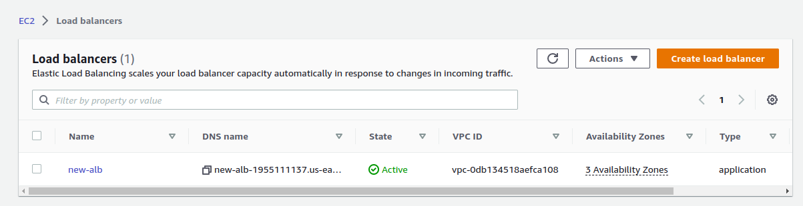

Project Website: http://terraform-test.onyekachukwuejiofornweke.me


# How to use Terraform and Ansible to deploy a High Availability Web Application
To execute this project you will need the following tools, resources and technologies:
- Ansible
- Terraform
- Internet Gateway
- VPC
- Route Table
- Load Balancer
- Security Groups
- AutoScaling group


## Creation of A Virtual Private Cloud (VPC)


VPC is used to isolate cloud resources in a public cloud by creating a private cloud.


## Creation of Four (3) Subnets 


I created four subnets, 2 private and 2 public each Availability Zone has Two subnets(1 public and 1 private)

The NAT gateway will be placed in the public subnets to be able to allow them to connect to the internet and provide a routing gateway for the private subnets

## Creation of the Three (3) Route tables


The main route table is the default route table and the Internet gateway will be connected to it.

While the other private route tables will be routed to the NAT gateway to allow the private instances internet access

## Creation of One (1) Internet Gateway


Internet gateways are created for VPCs to connect to the internet through routing tables.

## Creation of Two Nat Gateway


NAT gateways are used to provide resources especially instances in private subnets with internet access and are connected to those subnets through routing tables.

Elastic IPs are assigned to nat gateways


## Creation of Launch Template for AutoScaling Group


A Launch template is used for the creation of an AutoScaling Group so that the machine type used will be uniform to avoid infrastructural failure.


The ami id is used to create an identical machine instance for the project.


A security group is created for the template having port 80 for inbound and all traffic for outbound

And I created a launch script in the user data section which is also in user_data.sh

```
    #!/bin/bash
    sudo apt update -y
    sudo apt install -y --no-install-recommends php8.1
    sudo apt-get install -y php8.1-cli php8.1-common php8.1-mysql php8.1-zip php8.1-gd php8.1-mbstring php8.1-curl php8.1-xml php8.1-bcmath php8.1-fpm
    sudo systemctl reload php8.1-fpm
    git clone https://github.com/Onyekachukwu-Nweke/server_stats_template.git
    sudo apt install -y nginx
    sudo mv server_stats_template/assets /var/www/html/
    sudo mv server_stats_template/index.php /var/www/html/
    git clone https://github.com/Onyekachukwu-Nweke/Alt-School-Sem3-Holiday-Project.git
    sudo cat Alt-School-Sem3-Holiday-Project/nginx | sudo tee /etc/nginx/sites-available/default
    sudo mv /var/www/html/index.nginx-debian.html ../
    sudo systemctl reload php8.1-fpm
    sudo systemctl restart nginx
```

The nginx file is for the configuration of nginx for target machine

## Creation of AutoScaling Group (ASG)


An Auto Scaling group contains a collection of EC2 instances that are treated as a logical grouping for the purposes of automatic scaling and management. The ASG is used to avoid infrastructural failure.

In ASG you fill the amount of instances you want at every given time.

You can also fill in the subnets and avaialability zones where the instances will be created.


## View of the instances created by the ASG

According to the project requirement I ensured that the private instances did not have a public ip address.


## Creation of Application Load Balancer (ALB)

Application Load Balancer is used to evenly distribute network traffic from http and https requests. It sits at the very front of the vpc.

While creating an ASG I created an ALB and its target group also.

Port 80 is opened on the target group.

Target groups are where the ALB will be routing traffic to.





## Routing of Domain name

I created a hosted zone and a record using AWS service Route 53 for http://onyekachukwuejiofornweke.me


## End Game of The Project


### Special Recognition
- Patrick Aziken (Php template file)