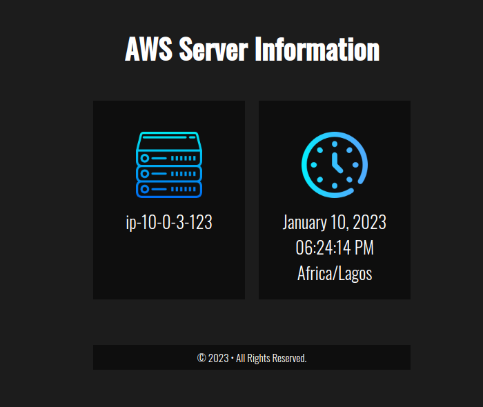

<!--  -->

Project Website: http://terraform-test.onyekachukwuejiofornweke.me


# How to use Terraform and Ansible to deploy a High Availability Web Application
To execute this project you will need the following tools, resources and technologies:
- Ansible
- Terraform
- Internet Gateway
- VPC
- Route Table
- Load Balancer
- Security Groups
- AutoScaling group


## Creation of A Virtual Private Cloud (VPC)


VPC is used to isolate cloud resources in a public cloud by creating a private cloud.


## Creation of Three (3) Subnets 


I created three subnets, each Availability Zone has One subnets(1 public)

These subnet are connected to the same route table to reduce complexity and cost.

## Creation of the Route table


The main route table is the main route table and the Internet gateway will be connected to it and it is the resource connecting all the resources in the VPC to the internet. It contains three subnets explicitly attached to it.

## Creation of One (1) Internet Gateway


Internet gateways are created for VPCs to connect to the internet through routing tables.


## Creation of Launch Template for AutoScaling Group


A Launch template is used for the creation of an AutoScaling Group so that the machine type used will be uniform to avoid infrastructural failure.


The ami id is used to create an identical machine instance for the project.


A security group is created for the template having port 80 for inbound and all traffic for outbound


## Creation of AutoScaling Group (ASG)


An Auto Scaling group contains a collection of EC2 instances that are treated as a logical grouping for the purposes of automatic scaling and management. The ASG is used to avoid infrastructural failure.

In ASG you fill the amount of instances you want at every given time.

You can also fill in the subnets and avaialability zones where the instances will be created.

## View of the instances created by the ASG

According to the project requirement I ensured that the public instances did have a public ip address.


## Creation of Application Load Balancer (ALB)

Application Load Balancer is used to evenly distribute network traffic from http and https requests. It sits at the very front of the vpc.

While creating an ASG I created an ALB and its target group also.

Port 80 is opened on the target group, But traffic is routed to port 443.

Target groups are where the ALB will be routing traffic to.


## Routing of Domain name

I created a hosted zone and a record using AWS service Route 53 for https://terraform-test.onyekachukwuejiofornweke.me


## Adding of SSL Certificate

Using AWS Certificate Manager (ACM), created an SSL certificate for the domain name of my website and included all other subdomains using ```*``` wildcard.


## End Game of The Project



### Special Recognition
- Patrick Aziken (Php template file)